# 中断函数

## 简介

- 内中断
    - 软中断：
        - 系统调用：读写文件
    - 异常
        - 除零
        - 指令错误
        - 缺页错误
- 外中断
    - 时钟中断
    - 键盘中断
    - 硬盘中断
        - 同步端口IO
        - 异步端口IO
        - DMA Direct Memory Access
  

## 中断函数

* call / ret
    * eip
* int(interrupt) / iret (interrupt return)
    - eip
    - cs
    - eflags

## 中断向量表

中断向量就是中断函数的指针

> `0x000` ~ `0x3ff`

4个字节表示一个中断向量，总共有 256 个中断函数指针

段地址 << 4 + 偏移地址

* 偏移地址(ip)
* 段地址(cs)

    int nr; 中断函数编号 0 ～ 255

    invoke # 调用，引发，触发
    
## 内存分段

16bit 能访问64K内存，

32bit 访问所有的 4G 内存，也就是可以不分段，所以分段的概念就延续了下来；

> 奥卡姆剃刀原理

